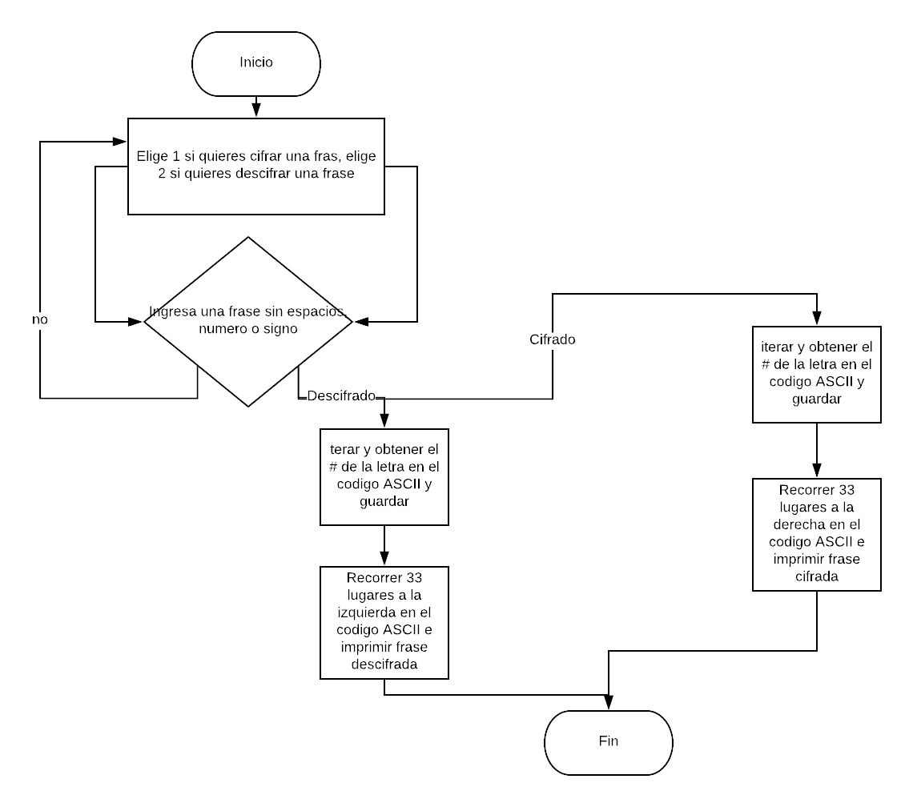

## Cifrado Cesar

### Descripción
Crear una página web que pida una frase al usuario y devuelva el mismo mensaje encriptado según el algoritmo de Cifrado César con el parámetro de desplazamiento de *33 espacios hacia la derecha*

### Pseudocódigo

1- Crear una página web con la documentación necesaria (html, JS, README, etc).

2- Por medio de un prompt pedir al usuario una frase sin espacios, números y/o signos.

3- Encriptar la frase según el algoritmo de cifrado Cesar con un parámetro de desplazamiento de 33 espacios hacia la derecha.

4- Retornar al usuario la frase cifrada.

#### Funcionalidad y Especificaciones

1- Guardar en una variable *message* la cadena solicitada por medio del prompt al usuario.

2- *var opcion* Dar a elegir al usuario si la cadena que ingreso desea cifrarla o descifrarla por medio de un prompt. Gracias a una condicional (if) nos permitirá ingresar a cualquiera de los dos casos.

3- Crearemos una función para cifrar la cadena ingresada, en la cual iteraremos (for) para encontrar si la cadena tiene Mayúsculas o Minúsculas de acuerdo al código ASCII utilizando string.fromCharCode y charCodeAt

##### Consideraciones Específicas

*Tu programa debe ser capaz de cifrar y descifrar tanto letras mayúsculas como minúsculas. La fórmula para descifrar es: (x - n) % 26
Tu código debe estar compuesto por 2 funciones con los siguientes nombres: cipher y decipher
El usuario no debe poder ingresar un campo vacío o que contenga números*.

### Diagrama de Flujo

